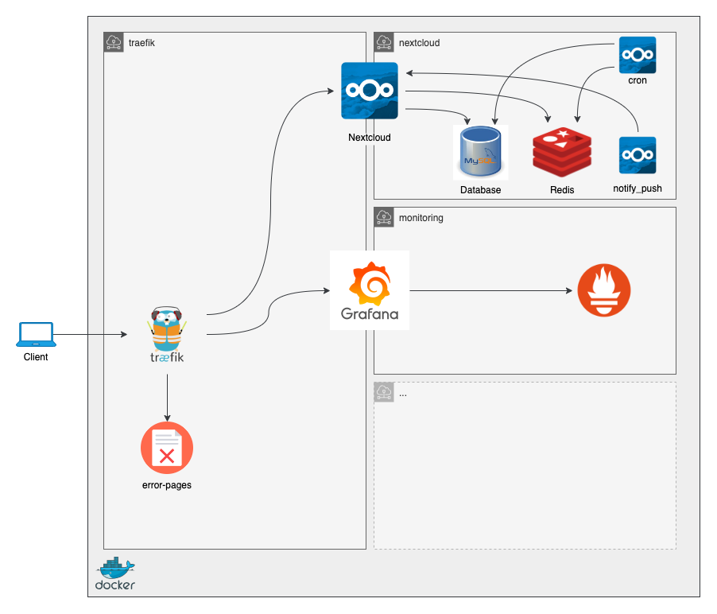

# docker-compose-homestack

This role is an opinionated approach to automating the creation of docker-compose files to run the software on my home
server.

## Why?

Started as a fork of the
[docker-compose-generator](https://github.com/ironicbadger/ansible-role-docker-compose-generator), this now works
differently. I just didn't find it very useful to have almost all the values and settings in the vars file and then have
a role that uses a template to simply transform it into its final state. It also didn't support using different networks
to segment the different stacks. So I decided to rewrite my original fork.

## Stack setup

All connections to all containers are proxied through traefik. This allows everything to be offered using TLS with
automatically generated Let's Encrypt certificates. To improve security and further isolate the containers, each stack
sits on its own network. Only the container that is the entrypoint or the frontend of the software is able to talk to
traefik and vice versa, all others are only able to communicate within their network.



## The stacks

### traefik

_traefik_ lives in the `traefik` network. This network also contains the _error-pages_ container that offers generic
error pages in case some service is not available.

### Nextcloud

Nextcloud needs a database, a redis and some other containers that make Nextcloud work.

During the first start, the database must be started first so it can be initialized. Only then start the nextcloud
container. Otherwise the installation somehow breaks.

```sh
% docker compose -f docker-compose-nextcloud.yml -p nextcloud up -d nc-db
[+] Running 2/2
 ✔ Network nextcloud-net  Created                                           0.1s
 ✔ Container nc-db        Started                                           1.0s
docker@memoryalpha ~/home-stack
 % docker compose -f docker-compose-nextcloud.yml -p nextcloud up -d nc-redis
[+] Running 1/1
 ✔ Container nc-redis     Started                                           1.1s
docker@memoryalpha ~/home-stack
 % docker compose -f docker-compose-nextcloud.yml -p nextcloud up -d nextcloud
[+] Running 3/3
 ✔ Container nc-redis   Healthy                                             0.9s
 ✔ Container nc-db      Healthy                                             0.9s
 ✔ Container nextcloud  Started
 ```

## Variables

Global variables

| Variable                               | default  | Description |
| -------------------------------------- | -------- | ----------- |
| `docker_compose_generator_output_path` | `"~"`    | |
| `docker_compose_generator_uid`         | `"1000"` | |
| `docker_compose_generator_gid`         | `"1000"` | |

Variables for Nextcloud

| Variable                                     | default      | Description |
| -------------------------------------------- | ------------ | ----------- |
| `docker_compose_generator_gid`               | `"1000"`     | |
| docker_compose_generator_nextcloud_active    | `true`       | |
| docker_compose_generator_nextcloud_base_path | _none_       | must be set |
| docker_compose_generator_nextcloud_user      | `"www-data"` | |
| docker_compose_generator_nextcloud_group     | `"www-data"` | |
| docker_compose_generator_nextcloud_image     | _none_       | must be set |
